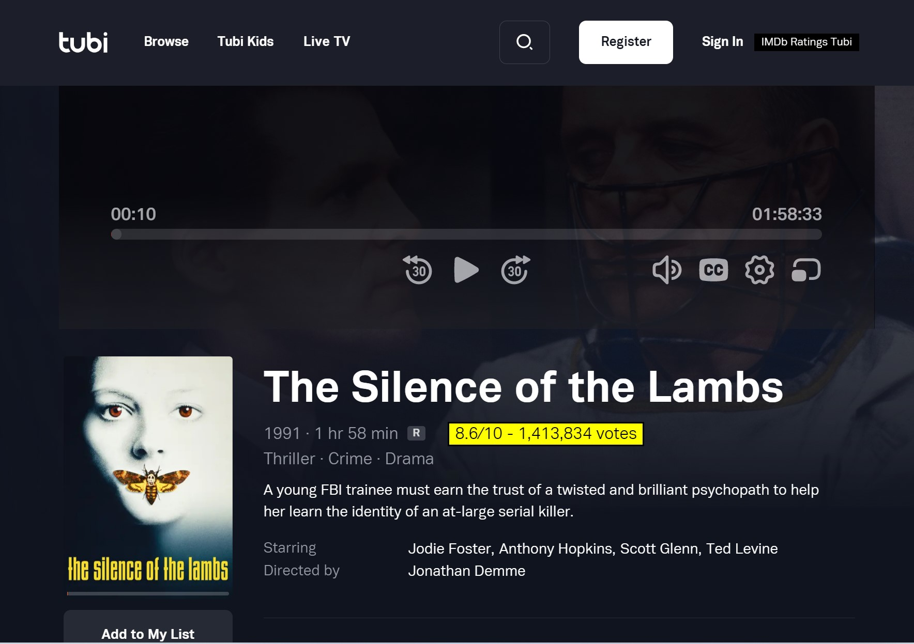

# IMDb Ratings on Tubi UserScript

## Features

This script adds IMDb ratings on the [Tubi](https://tubitv.com/) website.

## Installation

- [Install Tampermonkey](https://tampermonkey.net/) (this script is tested with Tampermonkey on Chrome). Or any other [UserScript client](https://www.greasyfork.org/) to your browser.
- Click the [RAW](https://raw.githubusercontent.com/leodoi3/tubi-imdb-ratings/master/tubi-imdb-ratings-userscript.js) link of the script to install it to your userscript client

## Setup
You will need a free [OMDb API key](https://www.omdbapi.com/) and enter the key in the settings page. 

# Donate
If you like my work, please consider [donating](https://www.paypal.com/donate/?hosted_button_id=28KJ54Y3L6CY8).